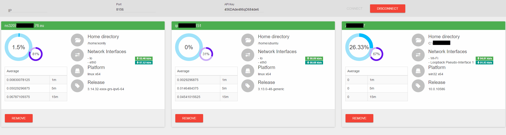

# Monitoring-easy web interface

## /!\ Work in progress /!\

# How to use

Build the project with `webpack` or `npm run webpack-dev` and copy the www directory on your static server.

# Development

To prepare `npm install`

Unique build `webpack`

build dev (live reload) `npm run webpack-dev`
